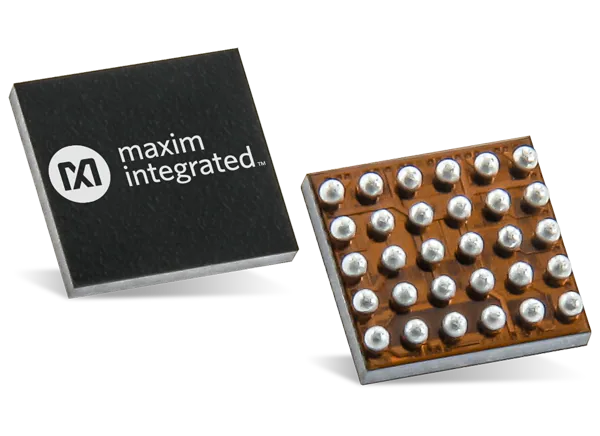

# MAX30001 Complete biopotential and bioimpedence AFE

General Description taken from the [MAX30001 Datasheet](https://datasheets.maximintegrated.com/en/ds/MAX30001.pdf).

The MAX30001 is a complete, biopotential and bioimpedance (BioZ), analog front-end (AFE) solution for wearable applications. It offers high performance for clinical and fitness applications, with ultra-low power for long battery life. The MAX30001 is a single biopotential channel providing electrocardiogram (ECG) waveforms, heart rate and pacemaker edge detection, and a single bioimpedance channel capable of measuring respiration.

The biopotential and bioimpedance channels have ESD protection, EMI filtering, internal lead biasing, DC leadsoff detection, ultra-low-power, leads-on detection during standby mode, and extensive calibration voltages for builtin self-test. Soft power-up sequencing ensures no large transients are injected into the electrodes. Both channels also have high input impedance, low noise, high CMRR, programmable gain, various low-pass and high-pass filter options, and a high resolution analog-to-digital converter. The biopotential channel is DC coupled, can handle large electrode voltage offsets, and has a fast recovery mode to quickly recover from overdrive conditions, such as defibrillation and electro-surgery. The bioimpedance channel includes integrated programmable current drive, works with common electrodes, and has the flexibility for 2 or 4 electrode measurements. The bioimpedance channel also has AC lead off detection.

# Repository Contents

* **/software** - Arduino library and example sketches

# Wiring the chip to your Arduino

|MAX30001 pin label  | MAX30001 pin label | Arduino Connection  | Pin Function      |
|------------------ :|-----------------  :|------------------- :|----------------- :|
| SDO         		 | E03     		      | D12                 |  Slave out 	    |             
| SDI    		     | E04     			  | D11                 |  Slave in         |
| SCK      		     | E05   		      | D13                 |  Serial clock     |
| CSB    		     | E06      		  | D7                  |  Slave select	    |
| FCLK     		  	 | D05    			  | NC                  |  External clock(32KHz) |
| INT1      		 | D02    		      | D2                  |  Interrupt        |
| INT2       		 | E02       		  | NC                  |  Interrupt        |
| OVDD, DVDD, AVDD   | D03, D06, E01      | Supply 3V3     		|  Board which supports 3.3V and 1.8V |
| OVDD, DVDD, AVDD   | D03, D06, E01      | Supply 5V       	|  5V               |
| AGND, DGND    	 | B02, B04, C03, C04, D04, C05 | Gnd 		|  Ground		    |

# Running the Arduino Sketch

If you have correctly installed the libraries, the example sketeches should now be available from within Arduino.

[Download the Arduino Sketch here for this board here.](https://github.com/kkasper/max30001/releases/download/v0.1/max30001_arduino.zip)

Open up your Arduino IDE and run the Arudino sketch (.ino) file in the archive that you downloaded. Your Arduino should now be programmed to read the ecg data and sending over the USB-UART.  

*Warning:
When connecting the electodes to the body, it is safer to disconnect the mains power source to the Arduino. For example, if you are using the Arduino along with a laptop, disconnecting the battery charger from the laptop would be a safe option.*

License Information
===================

This product is open source! Both, our hardware and software are open source and licensed under the following licenses:

Software
--------

**All software is released under the MIT License(http://opensource.org/licenses/MIT).**

THE SOFTWARE IS PROVIDED "AS IS", WITHOUT WARRANTY OF ANY KIND, EXPRESS OR IMPLIED, INCLUDING BUT NOT LIMITED TO THE WARRANTIES OF MERCHANTABILITY, FITNESS FOR A PARTICULAR PURPOSE AND NONINFRINGEMENT. IN NO EVENT SHALL THE AUTHORS OR COPYRIGHT HOLDERS BE LIABLE FOR ANY CLAIM, DAMAGES OR OTHER LIABILITY, WHETHER IN AN ACTION OF CONTRACT, TORT OR OTHERWISE, ARISING FROM, OUT OF OR IN CONNECTION WITH THE SOFTWARE OR THE USE OR OTHER DEALINGS IN THE SOFTWARE.

Documentation
-------------
**All documentation is released under [Creative Commons Share-alike 4.0 International](http://creativecommons.org/licenses/by-sa/4.0/).**

You are free to:

* Share — copy and redistribute the material in any medium or format
* Adapt — remix, transform, and build upon the material for any purpose, even commercially.
The licensor cannot revoke these freedoms as long as you follow the license terms.

Under the following terms:

* Attribution — You must give appropriate credit, provide a link to the license, and indicate if changes were made. You may do so in any reasonable manner, but not in any way that suggests the licensor endorses you or your use.
* ShareAlike — If you remix, transform, or build upon the material, you must distribute your contributions under the same license as the original.

Please check [*LICENSE.md*](LICENSE.md) for detailed license descriptions.
